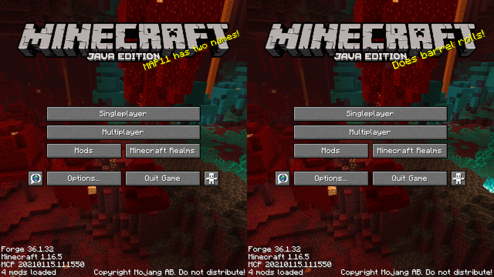
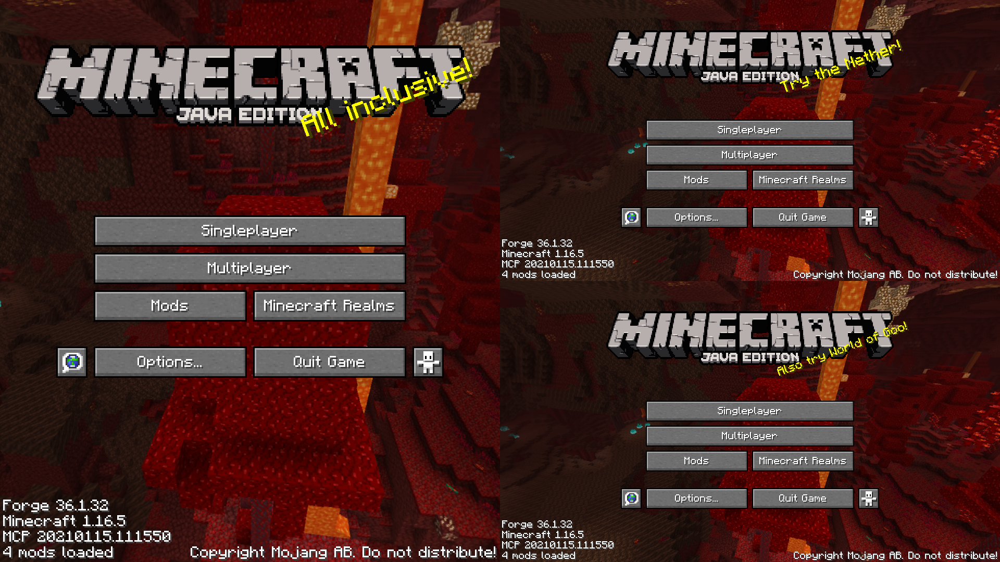
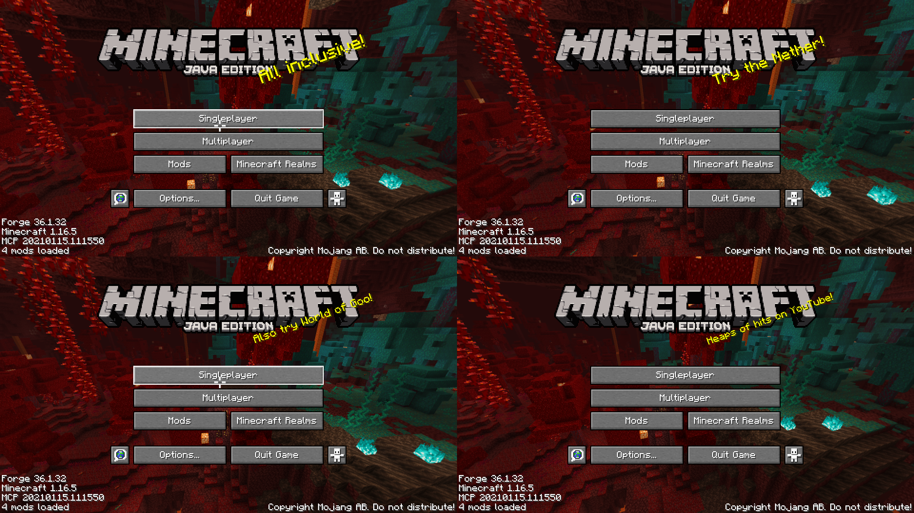

# splitscreen

Split screen / couch co-op game window(s) adjuster.

Works by removing window title and borders, then resizing and re-positioning windows on screen (splitscreen for 2/3/4 players).

By default works with Minecraft (with Controllable mod) - just launch up to four instances of Minecraft and run splitscreen.

Two players/windwows

Three players/windows

Four players/windows

ToDo:
 - horizontal splitscreen support
 - multi-monitor support
 - makefile
